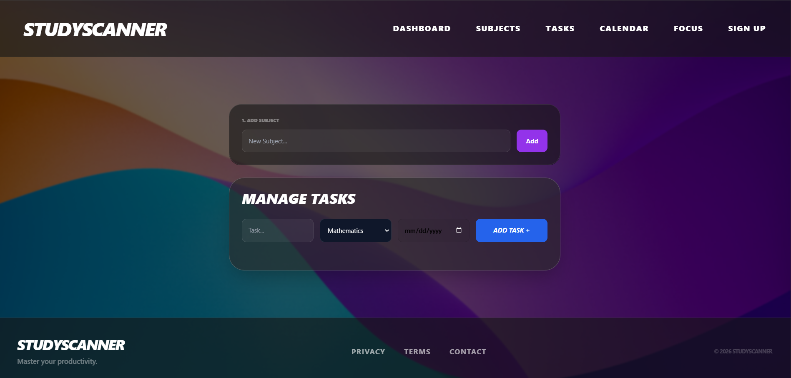

# StudyScanner

## Project Description
This is a high performance study productivity tool built for students who need more than a simple to-do tool.
It has 6 pages.
They include:
1. Dashboard Page
2. Subjects Page
3. Tasks Page
4. Calendar Page
5. Focus Page
6. Authentication Page

## Key Features
1. Custom Subject Management - Users are not restricted to defaults since they can create and manage their own subjects
2. Subject linked tasks - Every task is assigned to a specific subject
3. Interactive Study Calendar - A calendar view that marks deadlines with status indicators for easy scheduling
4. Progress Dashboard - Real time calculation of completion percentages and task streaks to maintain study motivation
5. Local Persistence - All data is saved to the local storage,ensuring no data loss on refresh

## Designs Used
* Glassmorphism aesthetic - Semi-transparent backgrounds
* Vibrant gradients - Immersive background colors 
* High Contrast Typography - Heavy headings for a bold user experience

## TECHNOLOGIES USED
1. React
2. Tailwind CSS

# INSTALLATION & SET UP
1. Clone the repository
https://github.com/Natasha-tech-art/Study-Planner.repo.git
2. Run the application

# Screenshot of one of the pages       

## Future Roadmap
I would like to add the following in future:
1. User Authentication
2. Export study reports as PDF

